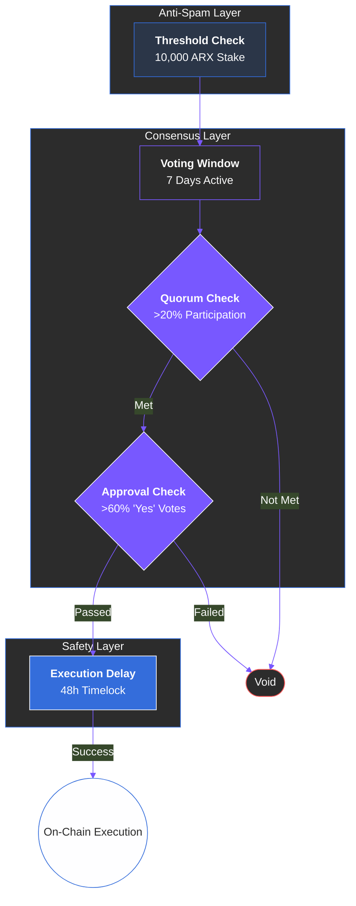

# 9.4 Governance Parameters

ARX governance operates under a set of clear and predefined parameters designed to maintain transparency, predictability, and accountability. These technical guardrails ensure that the decision-making process is resistant to manipulation while remaining responsive to the community's needs.

### Core Governance Constants

The following parameters define the lifecycle and requirements of every on-chain proposal. These values are calibrated to balance speed with security:

| **Parameter** | **Description** | **Default Value** |
| :--- | :--- | :--- |
| **Proposal Creation Threshold** | Minimum ARX stake required to submit a proposal. | **10,000 ARX** |
| **Voting Duration** | The window during which votes are actively accepted. | **7 days** |
| **Quorum Requirement** | Minimum total participation rate for a vote to be valid. | **20% of staked supply** |
| **Approval Threshold** | Minimum "Yes" votes required for a proposal to pass. | **60% of votes cast** |
| **Execution Delay** | The "Timelock" period between approval and execution. | **48 hours** |
| **Delegation Support** | Capability for holders to delegate voting power. | **Enabled** |

---

### Adaptability and Safeguards

These rules are not static. To ensure the network remains future-proof, all governance parameters can be modified—but **only** through a successful DAO proposal that meets the current high-threshold requirements.


**The Quorum Safety Net**
The 20% Quorum requirement is a vital safeguard. It ensures that a small, highly active minority cannot force through radical changes without the tacit or explicit approval of a significant portion of the staking community.



**Execution Delay (Timelock)**
The 48-hour delay is a critical security feature. It provides a "cool-down" period for the community to react or for validators to review the code one last time before it automatically alters the network state.
