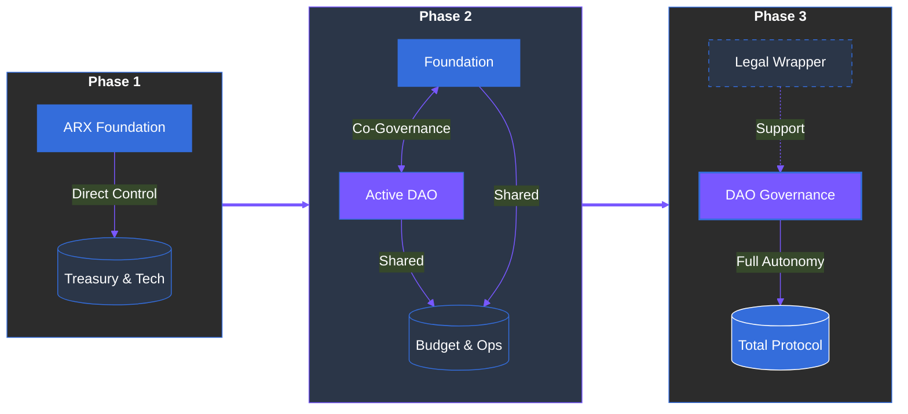

# 9.5 Transition to Full Community Control

ARX follows a structured decentralization path that transitions from foundation-led oversight to full community-led DAO governance. This gradual approach is designed to maintain **operational stability** and high security standards while progressively empowering token holders to take ownership of the ecosystem.

### Phase 1: Foundation Governance (Bootstrapping)
In the initial stage, the **ARX Foundation** acts as the primary steward of the network.
* **Treasury Operations:** Managed via a secure, controlled multi-signature (Multi-sig) structure.
* **Network Security:** The Foundation focuses on code audits, bug bounties, and stabilizing core infrastructure.
* **Oversight:** Strategic decisions are led by core contributors to ensure the long-term vision remains intact during the critical launch window.

### Phase 2: Hybrid DAO Activation (Co-Governance)
As the network matures and the token distribution broadens, the **Hybrid DAO** phase begins.
* **DAO Functionality:** Token holders gain the ability to submit on-chain proposals, vote on protocol parameters, and allocate community budgets.
* **Shifting Roles:** The Foundation transitions from a "director" to a **"coordinator,"** focusing on legal compliance, cross-chain partnerships, and ensuring DAO votes align with the technical roadmap.
* **Shared Control:** High-impact changes require a dual-consensus between the community vote and the Foundation’s security multi-sig.

### Phase 3: Full DAO Governance (Independence)
The final milestone marks the achievement of **Complete Decentralization**.
* **Direct Control:** The DAO assumes 100% control over all governance logic, treasury assets, and the upgradeability of smart contracts.
* **The Legal Wrapper:** The ARX Foundation remains solely as a legal entity under **Swiss Law** to provide legal and regulatory representation for the protocol in the physical world (e.g., signing contracts or managing IP).
* **Self-Sovereignty:** The protocol becomes a public good, governed entirely by its global participants.

---


**The Safety First Approach**
This phased transition protects the network from "governance attacks" or premature radical changes. By delegating power as the community grows, ARX ensures that the DAO is well-prepared and educated before taking full responsibility for the treasury.



**Swiss Regulatory Framework**
By maintaining a lean Foundation in Phase 3, ARX provides the DAO with a "legal personhood" recognized under Swiss jurisdiction. This allows the decentralized community to interact with traditional financial systems and legal frameworks while remaining fundamentally autonomous.
