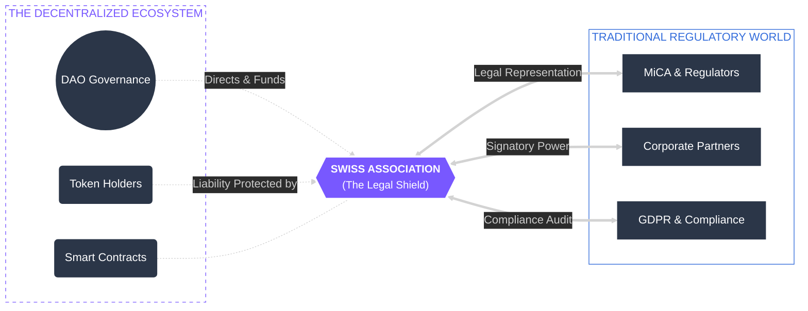

# 9.6 Legal and Compliance Framework

The ARX DAO operates under a **Swiss Association (Verein)** model, a strategic legal structure that provides formal recognition in the physical world while preserving the decentralized nature of the digital protocol. By establishing this "Legal Wrapper," ARX bridges the gap between autonomous code and global regulatory requirements.

### Key Functions of the Swiss Association

The association serves as the DAO’s institutional interface, performing critical functions that a pure smart contract cannot:

* **Legal Personality:** Grants the DAO the capacity to hold intellectual property (IP), enter into commercial agreements with service providers, and open institutional accounts under Swiss jurisdiction.
* **Regulatory Alignment:** Acts as the accountable legal entity to ensure compliance with the **EU’s Markets in Crypto-Assets (MiCA)** regulation and **GDPR** data protection standards. This includes managing mandatory disclosures and periodic legal audits.
* **Liability Protection:** Segregates the DAO’s operational risks from the personal assets of individual token holders and contributors, providing a layer of protection typical of traditional corporate structures.
* **Stability and Recognition:** Leveraging Switzerland's advanced **DLT-Law (Distributed Ledger Technology Act)**, ARX benefits from a clear, pragmatic legal framework that is recognized by global financial institutions and regulators.

---


**Why Switzerland?**
Switzerland is a global leader in blockchain legislation. Its principle-based regulation allows ARX to remain innovative while providing the "Legal Certainty" required for institutional partnerships and long-term sustainability.



**MiCA Readiness**
The Swiss Association model allows ARX to appoint a legal representative to fulfill MiCA’s requirements for token issuers and service providers, ensuring the ecosystem remains accessible to European users and markets.
