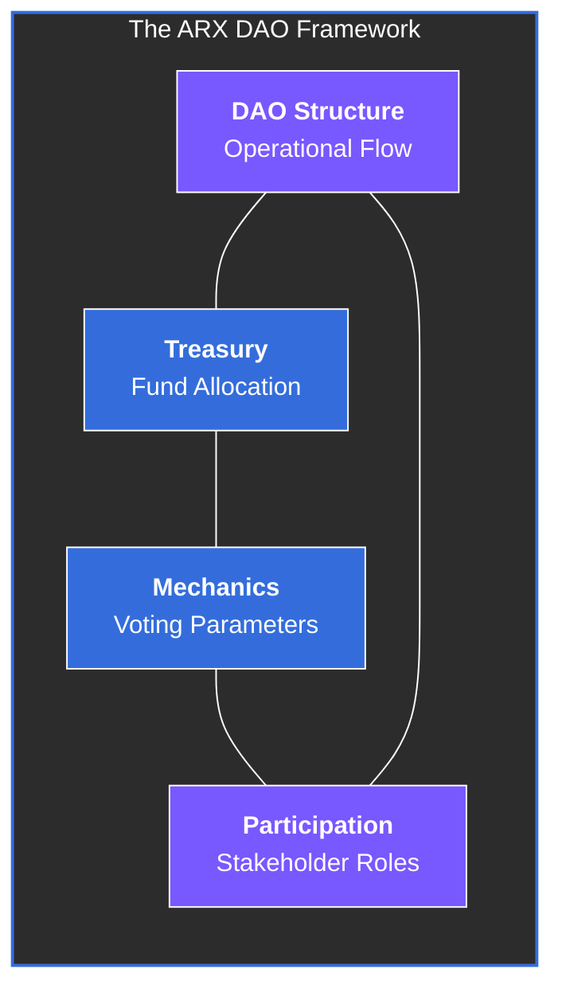

# 9 Governance Model

The ARX governance model defines how the network evolves, allocates resources, and maintains accountability through on-chain, community-driven decision-making. Governance ensures that the ARX ecosystem operates transparently, sustainably, and without any centralized control.

Every stakeholder who contributes to the network—from node operators to long-term holders—can participate in shaping its future through verified, **on-chain procedures**.

### Strategic Focus Areas

This section provides a detailed breakdown of the governing framework:

* **DAO Structure & Operational Flow:** The lifecycle of a proposal from ideation to execution.
* **Treasury Management:** Principles for fund allocation, capital preservation, and ecosystem reinvestment.
* **Participation Framework:** The specific roles (Validators, Delegators, and Contributors) within the governance layer.
* **Voting Mechanisms:** Technical parameters, quorum requirements, and weighted voting logic.
* **Decentralization Roadmap:** The phased transition from core-team stewardship to full community autonomy.
* **Legal & Compliance:** The regulatory framework supporting the DAO’s operations in global jurisdictions.

---


**Governance for Resilience**
By removing single points of failure in the decision-making process, ARX ensures that the protocol remains neutral and resistant to external capture, maintaining its commitment to privacy and decentralization.



**Skin in the Game**
Participation is inherently linked to contribution. By aligning voting power with network stake and active participation, ARX ensures that those who are most invested in the network's health have a proportional voice in its future.
